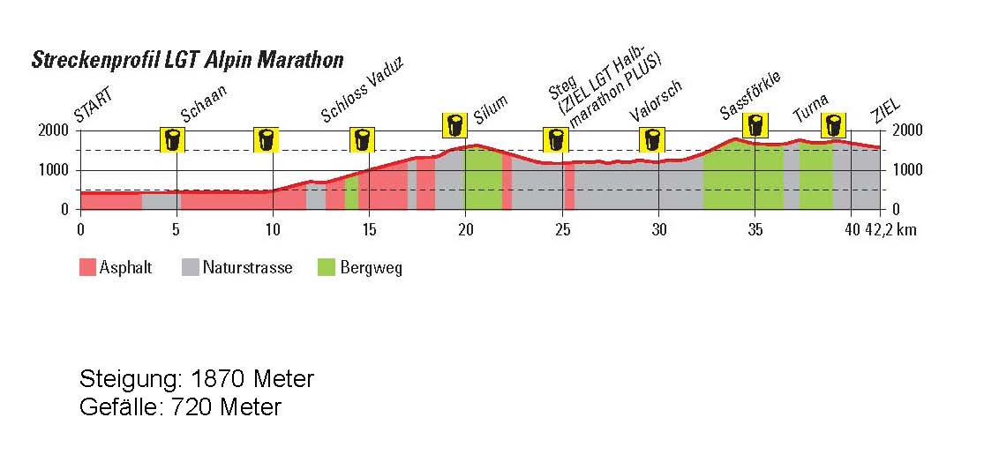
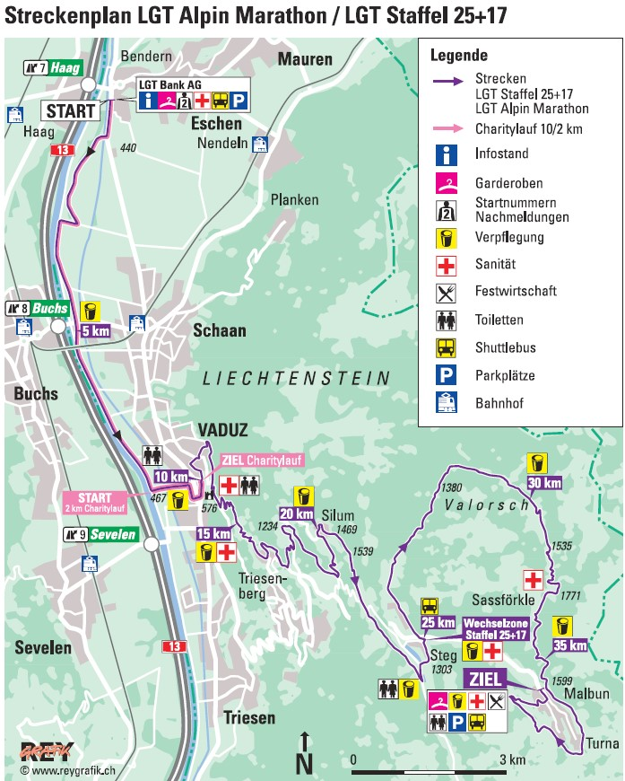

# LGT Half Marathon PLUS

## Overview
he LGT marathon takes place in the mountains of the Principality of Liechtenstein, tucked between Switzerland and Austria. The race can be run as a relay, breaking down into 25 kilometer and 17 kilometer segments. The first half of the course starts in the town of Bender, and runs along the Rhine river, through the village of Vaduz, past vineyards of the Prince of Liechtenstein and the famed castle of Vaduz. From there, runners climb through the mountains to the finish at Malbun. The full marathon follows pavement for the first third of the course, then moves onto village paths and tougher mountain trails. The half marathon includes a higher percentage of roads. An added bonus? There aren’t many races where you can say you’ve run from one border of the country to the other once you’ve finished!

## Event Details
- **Location**: Liechtenstein
- **Distance**: 25 km (Half Marathon Plus)
- **Event Type**: Running Race
- **Date**: June, 14th 2025 (9:00 a.m.)

## Course Information
- **Elevation Gain**: ~1121m (~3678ft)
- **Distance**: 25km (~15.5mi)
- **Trail Map**: [View on AllTrails](https://www.alltrails.com/explore/recording/lgt-liechtenstein-marathon--3?u=i)
- **Elevation Map**

- **Route Map**

## Training Information
## Other Details

---
